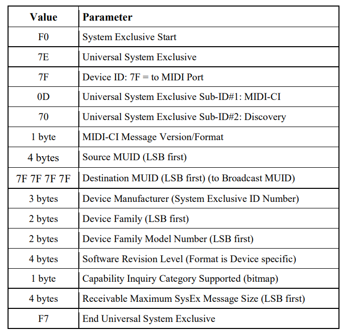
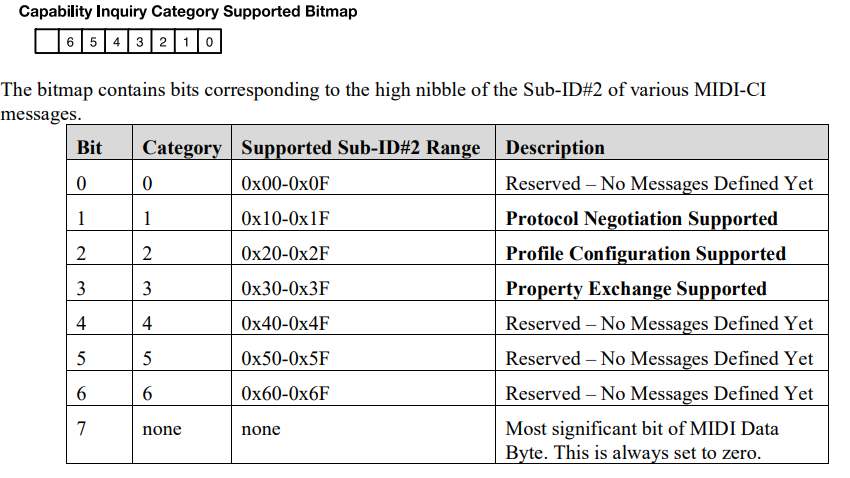
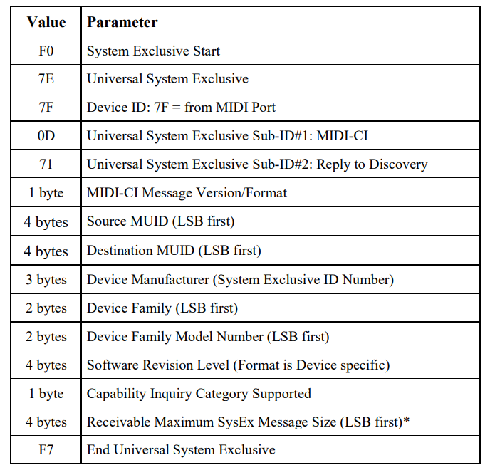

# MIDI-CI Inquiry and Response?

Let's say you have a **MIDI 2.0 Capable Device**, meaning the device communicates using Universal MIDI Packets (UMPs) and has MIDI Capability Inquiry (MIDI-CI) which allows MIDI devices to communicate with each other bidirectionally which gives the devices access to extended MIDI capabilities. What are these extended capabilities? What does MIDI-CI allow us to do?

 
What does MIDI 1.0 do?
=====
When you connect a MIDI 1.0 device (A) to a device (B) that understands MIDI 1.0, device A sends MIDI messages to device B. This is a one way communication channel, so device B cannot send messages to device A. 

Device A can send **Channel Voice Messages**, which contain music performance information such as Note On, Note Off, Pitch Bend. Device A can also send **System Exclusive Messages**, which is a message that can contain a large amount of data in any format. Every manufacturer of a MIDI device can format System Exclusive messages to send information such as presets, banks, patches, firmware updates, etc.

 Device A can also a lot of other types of messages (Channel Mode, System Common, System Real Time, System Exclusive), but for now to understand MIDI 2.0 and MIDI-CI we only need to understand Channel Voice Messages and System Exclusive Messages. 
 
 For a more detailed explanation about Channel Voice Messages in MIDI 1.0 and UMPs in MIDI 2.0, check out my *What is UMP?* post.

The First MIDI CI Transaction
=
When a MIDI 2.0 device (A) is powered on, it creates new random 28 bit ID for itself called an MUID. The MUID is a new random 28 bit ID every time the device powers on.

Next, on the transport that device A is connected to (USB, Ethernet, OS APIs, etc), device A sends a **Discovery Inquiry Message** in the form of a MIDI 1.0 System Exclusive Message.

The first two bytes (F0 7E) state that this is the start of a Universl System Exclusive Message. 
The next byte is the device ID the message is sent to which in the case of a Discovery Message is the whole MIDI port (7F).
The next two bytes indicate what kind of Universal System Exclusive Message we're sending, which is a MIDI-CI message (0D) and a Discovery Message (70).
The next byte is the MIDI-CI Message Version, we can use 01 for version 1 of MIDI-CI.
The next four bytes are the MUID of device A (Least Significant Byte first).
The next four bytes are the MUID of the destination of the message. Since this is a Discovery Message, we want to send it to everything on the network, so we use the **Broadcast MUID** (7F 7F 7F 7F).
The next four fields are information about the device.
We can use (7D 00 00) as the device manufacturer (this ID is generally used for educational purposes). We can use anything for the device family and family model number, so I'll use 01 00 for the Device Family and 01 00 for the Device Family Model Number as well. For the Software Revision Level, we can use a version number for this, so I'll use 00 00 00 01.
The next byte is a bitmap to identify what MIDI-CI messages are supported by the device.

Our device will support Protocol Negotiation, Profile Configuration, and Property Exchange, so we will use 00001110 (0E).
The next byte is the maximum size of System Exclusive Message that our device can recieve. This size must be atleast 128 bytes to support MIDI-CI and 512 bytes to support Profile Configuration and Property Exchange, so I'll set it to 512 (00 02 00 00).
The last byte (7F) states the ends of the Universal System Exclusive Message.

After sending that packet, Device A waits at least 3 seconds for all Replies to the discovery message.

Any device on the network can send a **Reply to Discovery Message** in response to the Discovery Message.

The format is very similar to the Discovery Message. We adjust the Sub-ID#2 to 71 to indicate that this is a reply message.
We include the device's MUID as the Source MUID and we use device A's MUID as the destination MUID. We can build the rest of the packet the same way as we built the Discovery Message.

We can call this Inquiry and Response a **MIDI-CI Transaction**. After this transaction, the two devices are aware of each other on the network and can send other MIDI-CI Inquiries such as a Profile Inquiry or a Property Capabilities Inquiry.

