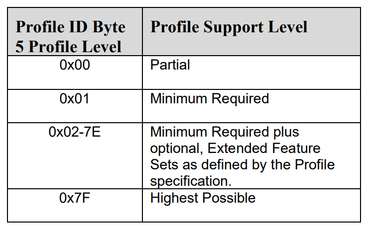
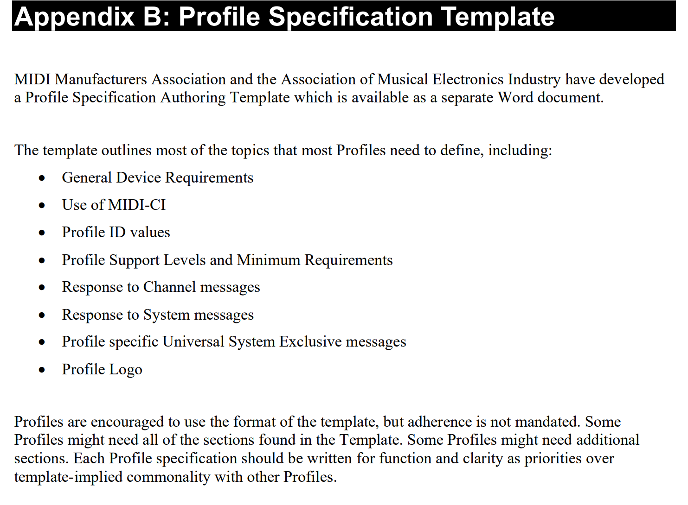
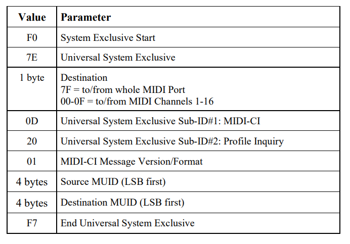
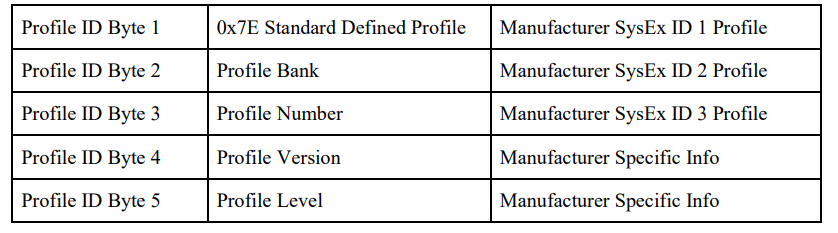
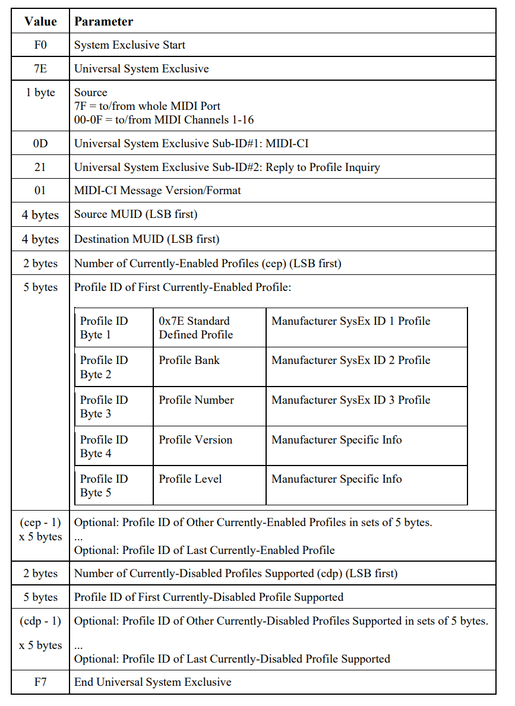
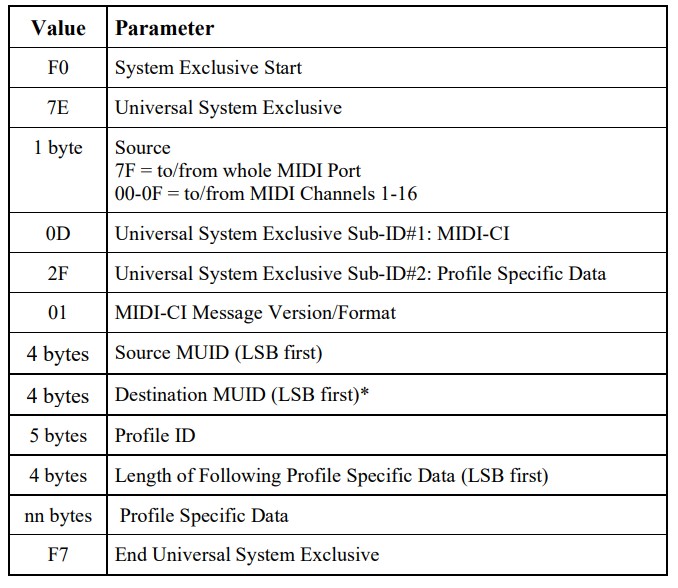

# What are Profiles in MIDI 2.0?

Let's say you have a **MIDI 2.0 Capable Device**, meaning the device communicates using MIDI Capability Inquiry (MIDI-CI) and UMPs (Univerisal MIDI Packets). Read my MIDI-CI and UMP blog posts to learn about the base requirements for a MIDI 2.0 device. Using MIDI-CI, MIDI 2.0 devices can self-configure how they communicate with other MIDI devices that have similar settings or profiles.

A Profile is a defined set of rules for how a MIDI device will respond to a chosen set of MIDI messages. This is similar to General MIDI for MIDI 1.0 where 128 program numbers are specified for specific instruments (1 is Acoustic Grand Piano, 74 is flute, 126 is Helicopter, etc) rather than arbitrary instruments defined by the manufacturer. So, when a device sends a program change message 74, the receiving device will play flute sounds.

Profiles can be supported by devices using both MIDI 1.0, MIDI 2.0, and any other protocols supported by MIDI-CI.

# What can a Profile do?

A Profile is defined in a Profile specification document which defines the receiver device's implementation of specific MIDI messages. For example, this could be a response to Note On/Off messages, CC Messages, RPN messages, any MIDI message. Within the specification document, there may be implementation requirements for the receiver such as Minimum Polyphony required, number of MIDI channels supported, other Non-MIDI data types supported, etc.

Note that CC Messages should not gain new definitions and RPN messages should control parameters not previously defined. For example, General MIDI 2 defines Reverb Level on CC#91 and it would be beneficial for a Profile that contains controls for reverb to use the same CC.

For increased functionality or resolution of an already defined control message, profiles may assign the parameter to a new RPN with approval from the MMA and AMEI or a new NRPN with specific approval.

## Levels of Compatibility

Profiles may define several levels of compatibility. Within a Profile specification are the set of features that are the minimum requirement to support a Profile and, if neccesary, a set of extended features available for a device to utilize within that profile. 

Partial is useful if a device generally supports a Profile but lacks some part of the defined Minimum Requirement.

## Profile Categories

Profiles are organized into three categories:

- Feature Profiles
- Instrument Profiles
- Effect Devices

Feature Profiles define features and MIDI implemetnation requirements that apply across a wide range of musical instrument types such as Per Note Experession, Zone Key Configuration, Real Time Direct Pitch Control, and more. Feature Profiles can also define features that record, edit, or modify MIDI data such as Arpeggiators, Sequencers, or other Rhythm/Music generators. Feature profiles can also define features like Lighting controls, Drone Flight controls, Video Effects, Mixer Controls, DAW Software controls, etc.

Instrument Profiles, much like General MIDI, can define different instruments or devices that Note On/Off messages would adhere to such as Piano, Strings, Brass, Drums, Subtractive Synths, FM Synths, etc.

Effect Profiles define features for different effect types such as Reverb, Chorus, Compressor, Distortion, Delay, etc.

# Profile Specification Template

I cannot find said separate Word document and I have requested it on the MIDI Forum

# Profile Configuration

For two MIDI 2.0 devices to utilize Profiles, they first must communicate using MIDI-CI. The first time MIDI 2.0 devices establish a MIDI-CI connection, after the Discovery Transaction and Protocol Negotiation, they can send inquiry about Profiles.

This MIDI-CI message requests a list of Profiles.

The receiver responds with a Reply Message that includes a list of Profile IDs that are currently enabled and a list of Profile IDs that are currently disabled.

Profile IDs are defined by 5 bytes. If the profile is defined or adopted by AMEI and MMA, they are Standard Defined Profiles and the 5 bytes encode the 0x7E to denote that it is a Standard Defined Profile, 1 byte for the Profile Bank, 1 byte for the Profile Number, 1 byte for the Profile Version, and 1 byte for the Profile Level. If the Profile is defined by anyone else, the first three bytes are the Manufacturer SysEx ID, and the last two bytes can be used freely by the manufacturer.

In MIDI-CI there are also messages to Enable Profiles, Disable Profiles, Respond to Enable, Respond to Disable, as well as a Profile Specific Data Message to send an arbitrary amount of data to a specific Profile.

