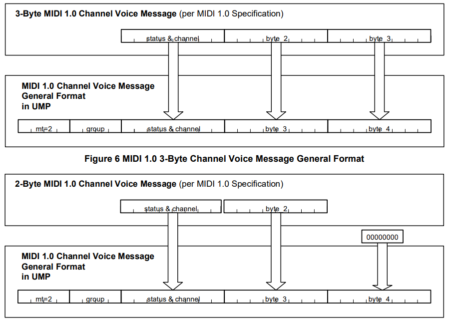
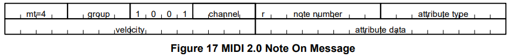

# What is UMP?

Let's say you have a **MIDI 2.0 Capable Device**, meaning the device communicates using MIDI Capability Inquiry (MIDI-CI) and UMPs (Univerisal MIDI Packets), a format new in MIDI 2.0 for sending MIDI messages. But how do UMPs improve upon the MIDI 1.0 message data format.

# What happens in MIDI 1.0

MIDI 1.0 messages are generally sent using one status byte followed by one or two data bytes with Real-Time messages and Exclusive messages being exceptions. The status byte identifies the message type and the data bytes idenitifies the content or parameters of the message. The most significant bit (MSB) of any status byte is always 1 and the MSB of any data byte is always 0 which means we only get 7bits of granularity for statuses and data.

A MIDI message such as Note On would have a status where the first four bits are 1001 and the last four represent the channel number (1-16) the message is sent over. The two data bytes represent the MIDI note number and the velocity of the note. And remember we only have 7bits (or 127 values) for the data.

# Universal MIDI Packets in MIDI 2.0

In MIDI 2.0, UMPs are one, two, three, or four 32-bit long words. Each UMP has fields for Message Type, Group, and Status. 

The first four bits of a UMP denote the Message Type field. There are six message types: Utility Messages, System Real Time and System Common Messages, MIDI 1.0 Channel Voice Messages, 64 bit Data Messages (including System Exclusive Messages), MIDI 2.0 Channel Voice Messages, and 128 bit Data Messages. All other message types are currently reserved for future definition by the MMA/AMEI. 

The next four bits denote the Group field. In MIDI 2.0 every UMP has a Group that communicates using only one MIDI protocol at a time. Each Group has its own 16 channels (allowing up to 256 MIDI channels). Each Group is seperate from all other Groups in terms of response to System Messages and all channels within a specific group are affected by MIDI messages that do not support a MIDI Channel field.

The next 4-8 bits denote the Status field. The value and size of the Status field depends on the Message Type.

## MIDI 1.0 Channel Voice Messages in UMP
Since MIDI 2.0 is backwards compatible with MIDI 1.0, MIDI 1.0 Channel Voice Messages are implemented in UMPs. The UMP adds message type and group in front of the two or three MIDI message bytes that one would see in MIDI 1.0

## MIDI 2.0 Channel Voice Messages in UMP

MIDI 2.0 Channel Voice Messages are 64 bit messages that include an 8bit Status field (4bits for the status, 4 bits for the channel), a 16bit Index field, and a 32bit data field. This allows for higher resolution parameters for channel voice messages. For example, the MIDI 2.0 Note On message includes a 16bit velocity field, a major improvement of resolution from the 7bit velocity field in MIDI 1.0, the MIDI 2.0 Poly Pressure message resolution expanded from 7bits to 32bits, and the Control Change message's resolution was expanded from 7bits to 32bits.

# New Features in MIDI 2.0

Along with increased resolution in MIDI 2.0 channel voice message fields, entirely new fields and messages are in MIDI 2.0. Note On and Note off messages have a new articulation type and articulation data field. Currently, there are four attributes types: No Attribute data, Manufacturer Specific, Profile Specific, and Pitch 7.9. Manufacturer Specific and Profile Specific attributes may be articulation information, pitch information, strike position, or any other performance information that a manufacturer may have designed for their MIDI 2.0 device or that is described in a MIDI 2.0 profile (check out my MIDI 2.0 Profile Blog post to learn more about Profiles)

The Pitch 7.9 attribute changes the note number field to a note index and the pitch becomes a Q7.9 fixed point unsigned integer that specifies pitch in semitones.

There's a new Per-Note Pitch Bend Message that allows for pitch bends that affect notes rather than entire channels like in MIDI 1.0 (MPE was introduced to MIDI in 2018 to allow 16 note pitch bend polyphony)

There are also new messages for Registered Per-Note Controllers, Assignable Per-Note Controllers, and Per-Note Management.